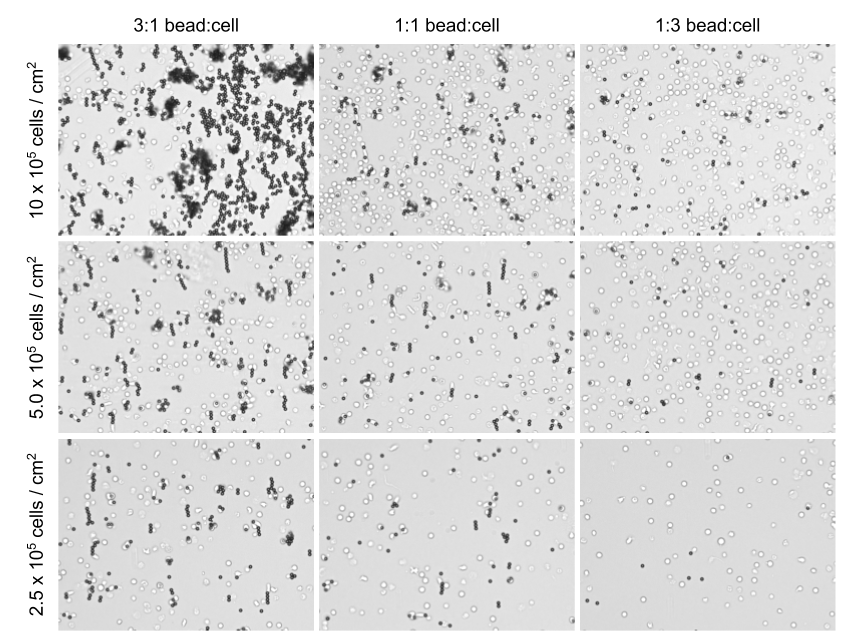

# Computational and experimental optimization of T cell activation

## Abstract
> Bead-based activation is widely-used for ex vivo expansion of T cells for either research or clinical purposes. Despite its wide use, culture conditions that can potentially affect the efficiency of bead-based T cell activation has not been extensively documented. With the help of computationally-driven experimental investigations of basic culturing factors, we found that culture density, bead-to-cell ratio, and debeading time can have a major impact on the efficiency of bead-based T cell activation for short-term cultures. Furthermore, discrepancies across expected and observed activation efficiencies helped discover interesting artifacts of bead-based T cell activation.
